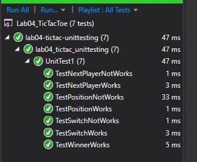

<!-- 
tell them what it is (with context, provide a summary)
show them what it looks like in action (Visuals)
show them how they use it (Step by step directions, “Happy Path” walk through)
tell them any other relevant details 

time tracker: 
1.11.19 9:00-11:45
1-11-19 11:15pm-1:30am
1-12-19 5:15
-->

# lab04-tictac
We were to build the Tic Tac Toe game. There are two players who are X's and O's and are trying to get 3 in a row on a 3x3 grid

# Solution

## Contributors

Trey Cain helped me figure out how to do unit testing with the classes (we have to add those NEW instances in the test code and you can't "global" variable them, you must create them per test')

